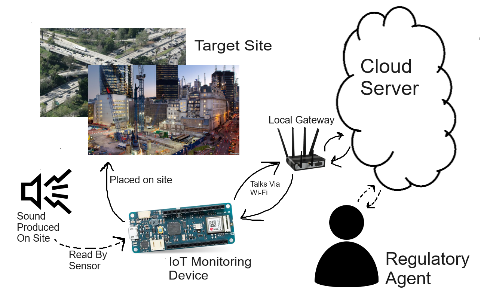
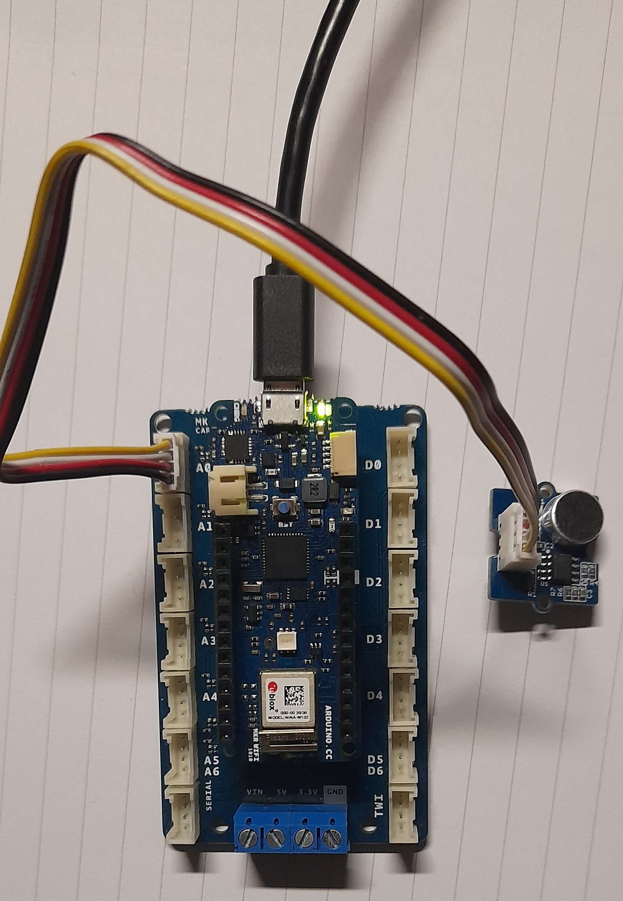

:Author: swyth
:Email:
:Date: 10/03/2024
:Revision: version#
:License: Public Domain

= Sound Monitoring System

A prototype sound monitoring system designed for regulatory bodies be it federal or private to monitor noise disturbances at construction sites, highways, train lines etc … 

== Installation
You will need to install the following arduino libraries:

1. WiFiNINA
1. ArduinoIoTCloud
1. Arduino_ConnectionHandler

For full functionality you will also need:

1. Node.js
1. python 3.6 or later

== Assemble the circuit

Assemble the circuit following the diagram layout.png attached to the sketch

==  Load the code

Upload the code contained in this sketch on to your board

=== Folder structure

....
 elec0017-cw                => Arduino sketch folder
  ├── elec0017-cw.ino       => Main Arduino file
  ├── ReadMe.adoc           => This file
  ├── server.js             => the webhook server
  ├── tests                 
  | └─ mock_server.py       => A mock server for testing the webhook server
  └── .github
    ├─ illustration.png     => An illustration of the project
    └─ architecture.png     => A diagram of the system architecture
....

=== Bill of Materials

|===
| ID | Part name      | Part number | Quantity
| A1 | MKR WiFi 1010  | Abx00023   | 1       
| A2 | MKR Connector Carrier        | ASX00007   | 1        
| S1 | Sound Sensor   | 101020023    | 1        
|===

=== Example of use
When assembled it should look something like this

=== Help
This document is written in the _AsciiDoc_ format, a markup language to describe documents. 
If you need help you can search the http://www.methods.co.nz/asciidoc[AsciiDoc homepage]
or consult the http://powerman.name/doc/asciidoc[AsciiDoc cheatsheet]
